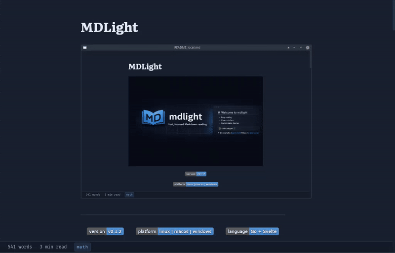

# MDLight



<p align="center">
  
  
  
  
  
</p>

A beautiful, lightweight Markdown reader — no vaults, no plugins, no accounts. Just open a file and read.

## Quick start

```sh
# Usage
mdlight document.md
mdlight notes.md --theme nord
mdlight                         # opens file picker
```

## Features

- **Full CommonMark + GFM**: tables, strikethrough, task lists, autolinks, fenced code blocks
- **Syntax highlighting**: code blocks styled via chroma with per-theme CSS palettes
- **YAML front matter**: title, date, tags rendered as a metadata card
- **Dark theme**: beautiful default-dark theme, swappable at runtime via `--theme`
- **File watching**: auto-reloads when the file changes on disk
- **Zoom**: Ctrl+= / Ctrl+- / Ctrl+0, status bar indicator
- **Image handling**: local images embedded as data URIs; remote images shown as click-to-load placeholders
- **Safe rendering**: raw HTML in Markdown is escaped for security — use Markdown syntax for images and formatting
- **Atomic saves**: write to temp file, rename over original — no half-written files
- **Drag-and-drop**: drag a Markdown file onto the window to open
- **Word count & reading time**: shown in the status bar

## Installation

### Quick install (Linux / macOS)

```sh
curl -sSL https://github.com/mdlight-dev/mdlight/releases/latest/download/install.sh | bash
```

Installs to `~/.local/bin/` and adds it to your PATH. Also installs a desktop entry and icon for the application menu.

### Package manager (Linux)

Download the appropriate package for your distro from the [releases page](https://github.com/mdlight-dev/mdlight/releases):

```sh
# Debian / Ubuntu
sudo dpkg -i mdlight_*.deb

# Fedora / RHEL
sudo rpm -i mdlight-*.rpm

# Alpine
sudo apk add mdlight-*.apk

# Arch
sudo pacman -U mdlight-*.pkg.tar.zst
```

Packages include a desktop entry so MDLight appears in your application menu.

### Pre-built binaries

Download the raw binary for your platform from the [releases page](https://github.com/mdlight-dev/mdlight/releases).

**Linux:**
```sh
# Download the latest Linux binary
url=$(curl -s https://api.github.com/repos/mdlight-dev/mdlight/releases/latest \
  | grep "browser_download_url.*linux_amd64\"" | cut -d'"' -f4)
curl -sL "$url" -o mdlight
chmod +x mdlight
sudo mv mdlight /usr/local/bin/
```

**Windows:** Download the `windows_amd64` binary from the [releases page](https://github.com/mdlight-dev/mdlight/releases), rename to `mdlight.exe`, and add to PATH.

[](https://github.com/mdlight-dev/mdlight/releases/latest)

### From source

Requires Go 1.23+, Node 20+, and platform webview libraries:

```sh
# Linux
sudo apt install libgtk-3-dev libwebkit2gtk-4.1-dev

# macOS
xcode-select --install

# Windows
# WebView2 is included in Windows 10+
```

```sh
git clone https://github.com/mdlight-dev/mdlight
cd mdlight
make build
./build/bin/mdlight README.md
```

## Usage

```sh
# Open a file
mdlight file.md

# Open with a specific theme
mdlight file.md --theme nord

# Open the file picker
mdlight
```

### Themes

Built-in themes: `default-dark`

User themes: place `.css` files in `~/.config/mdlight/themes/` and reference by name (without `.css` extension).

## Performance

Measured on Linux x86_64 (Intel Core i3-3110M @ 2.40GHz, 4 threads, 7.6 GiB RAM), opening a typical Markdown document:

| Metric | Measured | LDD target |
|--------|----------|------------|
| Resident memory (RSS) | ~210 MB | 70–150 MB |
| Binary size | 14 MB | — |
| WebKit init (startup) | ~250 ms | <500 ms |
| First render (OpenFile) | ~850 ms | — |

The RSS includes the WebKitGTK webview engine, which is the majority of the footprint. Plain Markdown files incur no extra loading; Mermaid and math libraries are only fetched when the document contains that syntax (v2.0).

## Project structure

```
mdlight/
  main.go              — CLI parsing, wails.Run bootstrap
  app.go               — Wails-bound methods (OpenFile, SaveFile, …)
  internal/
    render/            — goldmark + chroma pipeline, image rewriting
    theme/             — theme discovery and resolution
    watch/             — fsnotify wrapper with debounce
    state/             — recent-files persistence (v1.0)
  frontend/
    src/
      App.svelte       — Svelte application root
      style.css        — structural CSS rules (no hardcoded colors)
      themes/builtin/  — shipped theme files
      assets/fonts/    — Literata + JetBrains Mono
```

## Roadmap

- **v0.1** — Core Markdown reader (current)
- **v1.0** — Table of contents, find, edit mode, 6 built-in themes
- **v2.0** — Mermaid diagrams, KaTeX math, PDF export, focus mode
- **v3.0** — Community theme sharing via GitHub directory

## License

[MIT](LICENSE)

## Support

If you find MDLight useful, consider supporting development:

- **BTC**: `bc1qarlskqtdq4wsdudecktv6g7zqv5jv52at9k5uk`
- **ETH/ERC-20**: `0x03d42691a1f0d9af62899813e1f3937da0f6039b`
- **SOL/SLP**: `J9jneBCAW8NaoSj5KekxLyxBcYbzNq3F2Wshdar7FHdf`
